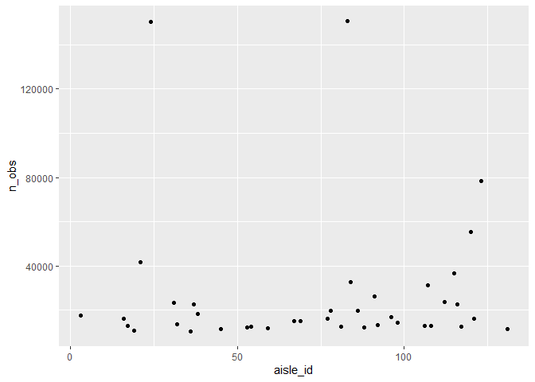

p8105_hw3_sz3213
================
Sitian Zhou
2023-10-07

``` r
library(tidyverse)
```

    ## ── Attaching core tidyverse packages ──────────────────────── tidyverse 2.0.0 ──
    ## ✔ dplyr     1.1.3     ✔ readr     2.1.4
    ## ✔ forcats   1.0.0     ✔ stringr   1.5.0
    ## ✔ ggplot2   3.4.3     ✔ tibble    3.2.1
    ## ✔ lubridate 1.9.2     ✔ tidyr     1.3.0
    ## ✔ purrr     1.0.2     
    ## ── Conflicts ────────────────────────────────────────── tidyverse_conflicts() ──
    ## ✖ dplyr::filter() masks stats::filter()
    ## ✖ dplyr::lag()    masks stats::lag()
    ## ℹ Use the conflicted package (<http://conflicted.r-lib.org/>) to force all conflicts to become errors

## Problem 1

``` r
library(p8105.datasets)
data("instacart")
```

There are 134 aisles, and the fresh vegetables aisle is the most items
ordered from, with the .

``` r
instacart |> 
  group_by(aisle) |> 
  summarize(n_obs = n()) |> 
  filter(n_obs == max(n_obs))
```

    ## # A tibble: 1 × 2
    ##   aisle             n_obs
    ##   <chr>             <int>
    ## 1 fresh vegetables 150609

``` r
instacart |> 
  group_by(aisle_id) |> 
  summarize(n_obs = n()) |> 
  filter(n_obs > 10000) |> 
  ggplot(aes(x = aisle_id, y = n_obs)) +
  geom_point()
```

<!-- -->

``` r
instacart |> 
  filter(
    aisle == "baking ingredients" |
    aisle == "dog food care" | 
    aisle == "packaged vegetables fruits") |> 
  group_by(aisle, product_name) |> 
  summarize(n_orders = n()) |> 
  mutate(
    n_order_rank = min_rank(desc(n_orders))
  ) |> 
  filter(n_order_rank <= 3) |> 
  select(product_name, aisle, n_orders) |> 
  knitr::kable()
```

    ## `summarise()` has grouped output by 'aisle'. You can override using the
    ## `.groups` argument.

| product_name                                  | aisle                      | n_orders |
|:----------------------------------------------|:---------------------------|---------:|
| Cane Sugar                                    | baking ingredients         |      336 |
| Light Brown Sugar                             | baking ingredients         |      499 |
| Pure Baking Soda                              | baking ingredients         |      387 |
| Organix Chicken & Brown Rice Recipe           | dog food care              |       28 |
| Small Dog Biscuits                            | dog food care              |       26 |
| Snack Sticks Chicken & Rice Recipe Dog Treats | dog food care              |       30 |
| Organic Baby Spinach                          | packaged vegetables fruits |     9784 |
| Organic Blueberries                           | packaged vegetables fruits |     4966 |
| Organic Raspberries                           | packaged vegetables fruits |     5546 |

``` r
instacart |> 
  filter(
    product_name == "Pink Lady Apples"|
    product_name == "Coffee Ice Cream") |> 
  group_by(product_name, order_dow) |> 
  summarize(mean_hour = mean(order_hour_of_day)) |> 
  pivot_wider(
    names_from = product_name,
    values_from = mean_hour) |> 
  knitr::kable()
```

    ## `summarise()` has grouped output by 'product_name'. You can override using the
    ## `.groups` argument.

| order_dow | Coffee Ice Cream | Pink Lady Apples |
|----------:|-----------------:|-----------------:|
|         0 |         13.77419 |         13.44118 |
|         1 |         14.31579 |         11.36000 |
|         2 |         15.38095 |         11.70213 |
|         3 |         15.31818 |         14.25000 |
|         4 |         15.21739 |         11.55172 |
|         5 |         12.26316 |         12.78431 |
|         6 |         13.83333 |         11.93750 |
